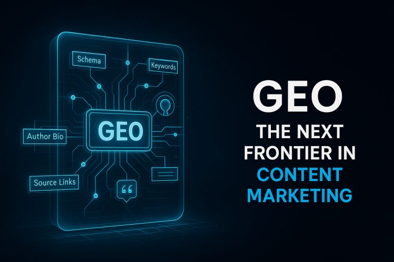

# GEO Tool — AI Visibility & Generative Search Intelligence Platform

GEO Tool is an AI-powered platform built for the next generation of search and digital visibility. It helps brands, agencies, and enterprises optimize their presence across AI-driven ecosystems, generative search engines, and semantic discovery platforms through intelligent analysis, GEO optimization, and actionable growth insights.

The platform combines AI visibility analysis, semantic intelligence, competitor research, content generation, and strategic optimization into a unified workflow. From deep domain analysis to humanized GEO-focused blog generation, GEO Tool is designed to help businesses improve discoverability, authority, and growth in the AI-first internet era.

Built using React, TypeScript, Node.js, and Gemini AI, the platform delivers enterprise-grade intelligence with a modern, high-performance user experience focused on real-time insights, actionable recommendations, and scalable AI-driven workflows.

## Run Locally

**Prerequisites:**  Node.js

1. Install dependencies:
   `npm install`
2. Set the `GEMINI_API_KEY` in [.env.local](.env.local) to your Gemini API key
3. Run the app:
   `npm run dev`
